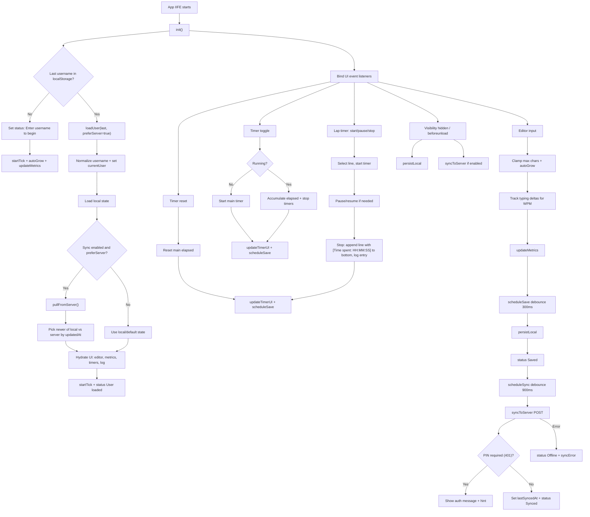

```mermaid
flowchart TD
    A["App IIFE starts"] --> B["init()"]
    B --> C["Bind UI event listeners"]
    B --> D{"Last username in localStorage?"}

    D -->|Yes| E["loadUser(last, preferServer=true)"]
    D -->|No| F["Set status: Enter username to begin"]
    F --> G["startTick + autoGrow + updateMetrics"]

    E --> H["Normalize username + set currentUser"]
    H --> I["Load local state"]
    I --> J{"Sync enabled and preferServer?"}
    J -->|Yes| K["pullFromServer()"]
    J -->|No| L["Use local/default state"]
    K --> M["Pick newer of local vs server by updatedAt"]
    M --> N["Hydrate UI: editor, metrics, timers, log"]
    L --> N
    N --> O["startTick + status User loaded"]

    C --> P["Editor input"]
    P --> Q["Clamp max chars + autoGrow"]
    Q --> R["Track typing deltas for WPM"]
    R --> S["updateMetrics"]
    S --> T["scheduleSave debounce 300ms"]

    C --> U["Timer toggle"]
    U --> V{"Running?"}
    V -->|No| W["Start main timer"]
    V -->|Yes| X["Accumulate elapsed + stop timers"]
    W --> Y["updateTimerUI + scheduleSave"]
    X --> Y

    C --> Z["Timer reset"]
    Z --> AA["Reset main elapsed"]
    AA --> AB["updateTimerUI + scheduleSave"]

    C --> LAP["Lap timer: start/pause/stop"]
    LAP --> LAP1["Select line, start timer"]
    LAP1 --> LAP2["Pause/resume if needed"]
    LAP2 --> LAP3["Stop: append line with [Time spent: HH:MM:SS] to bottom, log entry"]
    LAP3 --> AB

    T --> AC["persistLocal"]
    AC --> AD["status Saved"]
    AD --> AE["scheduleSync debounce 900ms"]
    AE --> AF["syncToServer POST"]
    AF --> AG{"PIN required (401)?"}
    AG -->|Yes| AH["Show auth message + hint"]
    AG -->|No| AI["Set lastSyncedAt + status Synced"]
    AF -->|Error| AJ["status Offline + syncError"]

    C --> AK["Visibility hidden / beforeunload"]
    AK --> AL["persistLocal"]
    AK --> AM["syncToServer if enabled"]

```